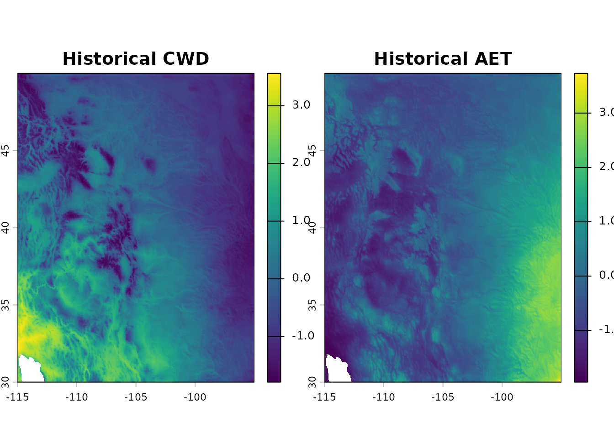
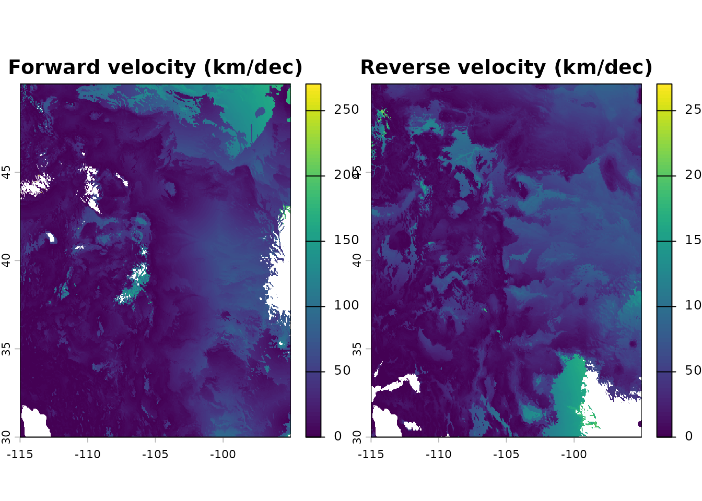
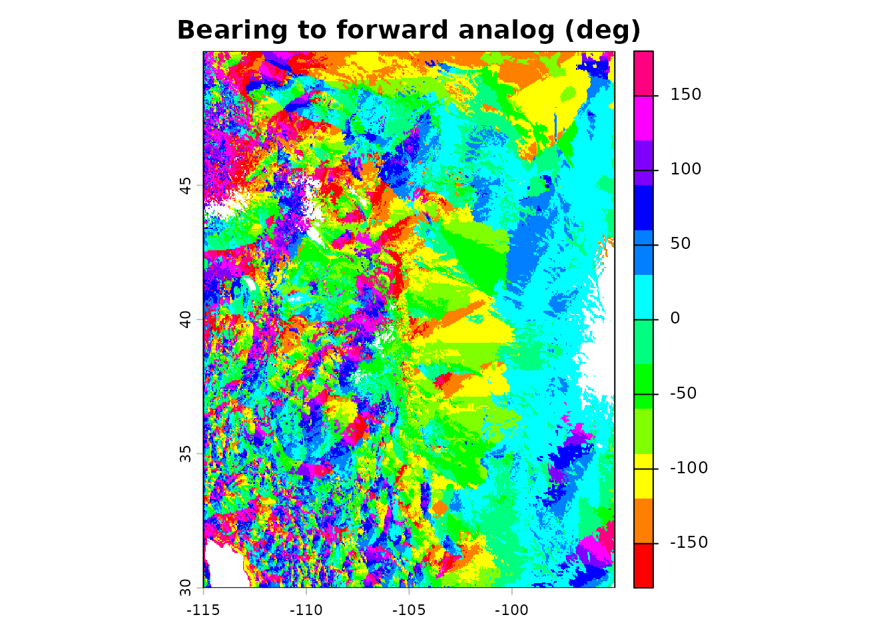
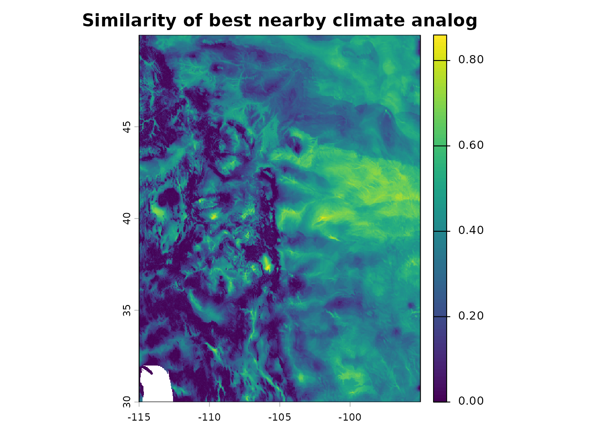
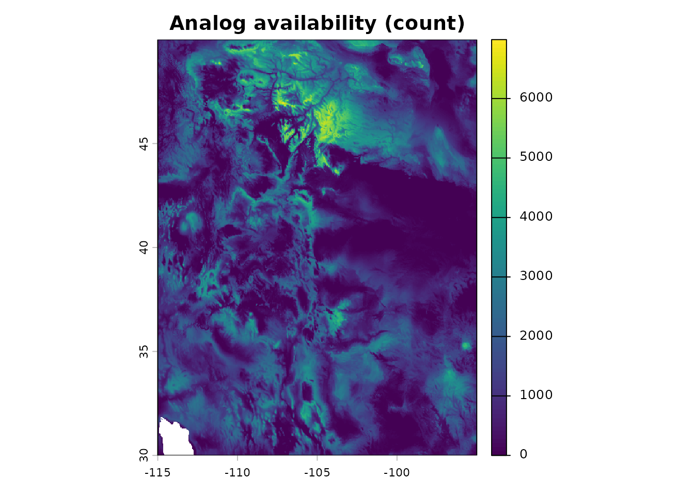
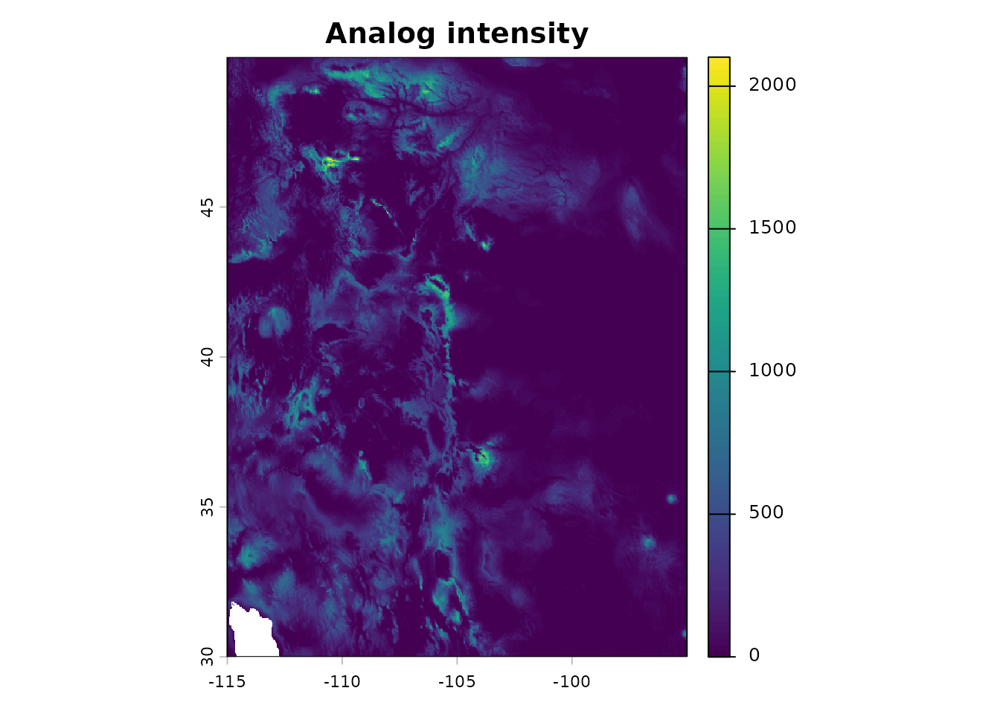
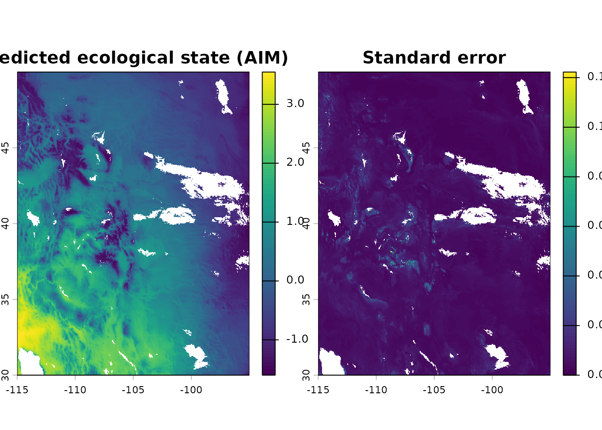
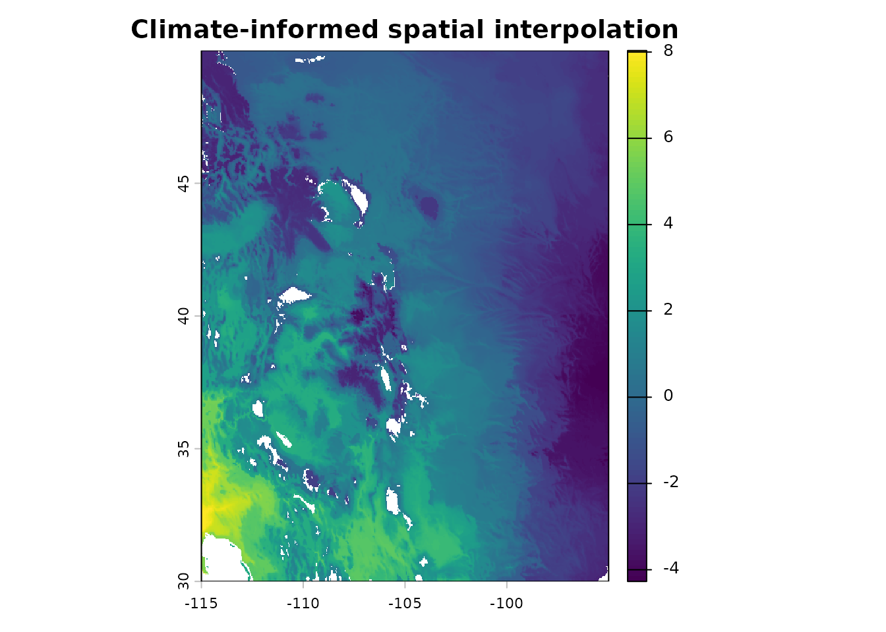
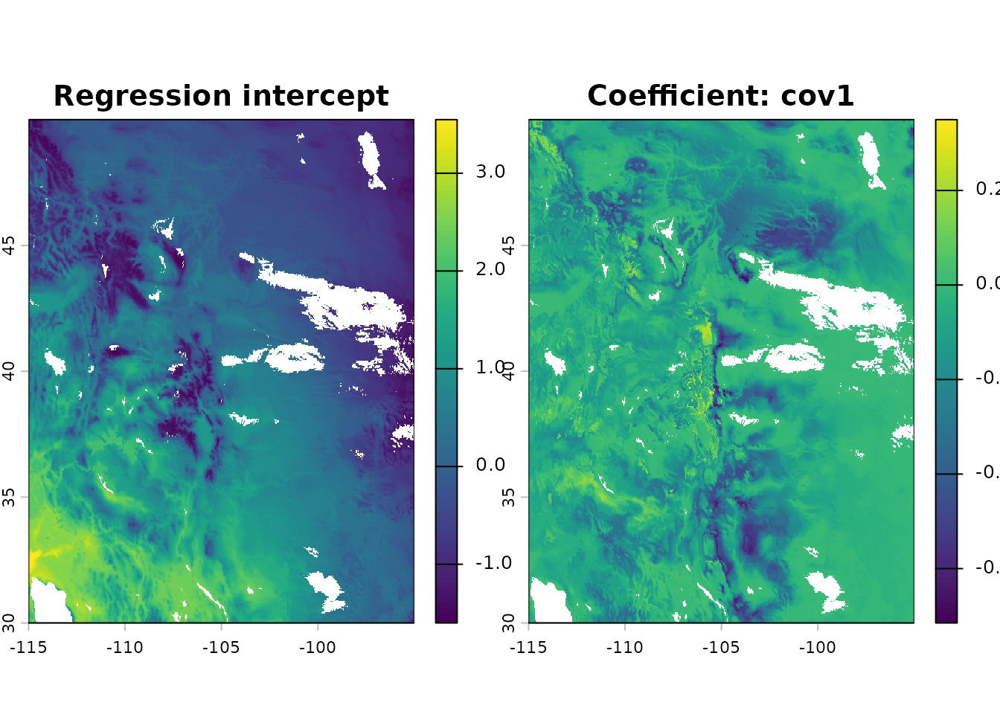
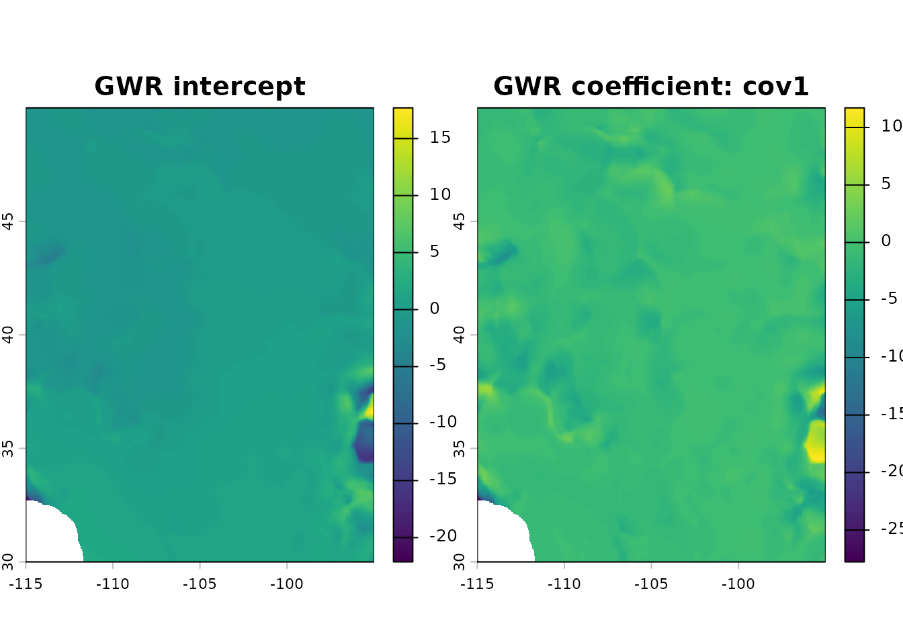

# Introduction to analogs

``` r
library(analogs)
#> Loading required package: RcppParallel
library(terra)
#> terra 1.9.11
```

## Overview

The **analogs** package implements a general framework for
distance-based neighborhood models. Every analysis follows a two-stage
pattern:

1.  First, **select** a neighborhood of analog locations from a
    reference pool, based on climate similarity, geographic proximity,
    or both.
2.  Optionally, **summarize** the neighborhood using counts, weighted
    means, regression coefficients, or other statistics.

Common methods in climate change ecology—climate velocity, analog impact
models, analog availability—are all specific configurations of this
framework. So are geographically weighted regression (GWR) and inverse
distance-weighted (IDW) interpolation, which use purely geographic
neighborhoods. The package implements these via a flexible core
function,
[`analog_search()`](https://matthewkling.github.io/analogs/reference/analog_search.md),
along with simplified wrappers for common analysis types.

The table below shows how each wrapper maps to the framework:

| Function                                                                                           | Neighborhood                                   | Summary          | Use case                                                 |
|----------------------------------------------------------------------------------------------------|------------------------------------------------|------------------|----------------------------------------------------------|
| [`analog_velocity()`](https://matthewkling.github.io/analogs/reference/analog_velocity.md)         | k nearest geographic, climate-constrained      | Pairs            | Where is this climate moving?                            |
| [`analog_similarity()`](https://matthewkling.github.io/analogs/reference/analog_similarity.md)     | k nearest climatic, geographically-constrained | Pairs            | What climates are reachable?                             |
| [`analog_availability()`](https://matthewkling.github.io/analogs/reference/analog_availability.md) | All within thresholds                          | Count            | Where do analogs exist?                                  |
| [`analog_intensity()`](https://matthewkling.github.io/analogs/reference/analog_intensity.md)       | All within thresholds                          | Weighted sum     | How strong are analog matches?                           |
| [`analog_impact()`](https://matthewkling.github.io/analogs/reference/analog_impact.md)             | All within thresholds                          | Weighted mean    | What ecological conditions to expect?                    |
| [`analog_regression()`](https://matthewkling.github.io/analogs/reference/analog_regression.md)     | Flexible                                       | Local regression | How do covariates predict outcomes within neighborhoods? |

## Data

All functions in the package require two data inputs: `x` (the set of
focal locations for which analogs are to be found) and `pool` (the set
of reference locations to search for analogs). These can be provided as
matrices, data.frames, or SpatRasters. `x` and `pool` must have the same
set of variables, but can be in different formats and can represent
different sets of sites.

Most of the examples in this vignette are focused on climate change, and
assume that `x` and `pool` come from different time periods with
different climates. In these situations, you typically have a choice
about which dataset to map to which of the two parameters, and swapping
them can give different insights. For example, as shown in the climate
velocity section below, swapping the parameter mapping switches the
analysis from forward to reverse velocity; while it’s only shown for
velocity, this is also possible for the other climate change analyses.
For non-climate-change applications like GWR and IDW shown toward the
end of this vignette, `x` and `pool` can be from the same time period.

The package includes an example dataset of climate rasters covering a
portion of western North America at approximately 5 km resolution, with
two scaled climate variables (climatic water deficit and actual
evapotranspiration) for a historical baseline (1981–2010) and a future
projection (2041–2070, SSP585). These are used throughout this vignette.

``` r
clim <- example_rasters()
hist <- clim$historic
fut <- clim$future

plot(hist, main = c("Historical CWD", "Historical AET"))
```



## Climate velocity

Analog-based climate velocity metrics are widely used to assess
dispersal constraints under climate change. Forward or outbound
velocity, the distance from a site to the nearest location with a
projected future climate similar to the site’s historical/current
climate, represents the migration required for current residents to
track baseline climate conditions. Reverse or inbound velocity, the
distance from a site to the nearest location with a historical climate
similar to the site’s projected future climate, represents constraints
on the arrival of new residents adapted to the site’s future conditions.

These metrics are implemented as a geographic nearest-neighbor search
under a hard climate constraint, with reverse velocity implemented by
swapping the climate data for the two eras. For each focal site, the
result returns data on its single nearest geographic analog (subject to
the climate similarity threshold `max_clim`). The geographic distance to
that analog, divided by the time elapsed, is the velocity. Sites with no
analog in the reference pool have `NA` results.

``` r
fwd_vel <- analog_velocity(
      x = hist,
      pool = fut,
      max_clim = 0.25,
      k = 1
)

rev_vel <- analog_velocity(
      x = fut,
      pool = hist,
      max_clim = 0.25,
      k = 1
)

decades <- 6
vel <- c(fwd_vel$geog_dist, rev_vel$geog_dist) / decades
plot(vel, range = range(minmax(vel)),
     main = c("Forward velocity (km/dec)", "Reverse velocity (km/dec)"))
```



In addition to geographic and climatic distances, the result also
includes the spatial coordinates of each site’s nearest analog (as well
as the analog’s index in the `pool`). This can be used for a variety of
downstream analyses, including visualizing the direction from a site to
its analog location:

``` r
fwd_vel$bearing <- geosphere::bearing(crds(fwd_vel, na.rm = FALSE), 
                                      values(fwd_vel)[, c("analog_x", "analog_y")])

plot(fwd_vel$bearing, main = c("Bearing to forward analog (deg)"),
     col = rainbow(12))
```



## Climate similarity

Climate similarity answers the inverse question from climate velocity:
for each location’s climate, what is the most similar climate within a
given geographic radius? This finds the most climatically similar
locations that are geographically reachable, which can provide insight
into how much climate change organisms must tolerate given limited
dispersal capacity.

``` r
sim <- analog_similarity(
      x = fut,
      pool = hist,
      max_geog = 100,
      k = 1
)

plot(sim$clim_dist, main = "Similarity of best nearby climate analog")
```



## Analog availability

How many analogs exist within specified climate and geographic
thresholds? This maps the density of suitable analogs across the
landscape. Locations with large numbers of nearby analogs have greater
potential for adaptive dispersal under climate change, while locations
with zero analogs represent novel or disappearing climates.

``` r
avail <- analog_availability(
      x = fut,
      pool = hist,
      max_clim = 0.5,
      max_geog = 200
)

plot(avail, main = "Analog availability (count)")
```



## Analog intensity

Similar to availability, but weighted by climate similarity and/or
geographic proximity rather than simply counted. This captures both the
number and quality of analog matches.

``` r
intens <- analog_intensity(
      x = fut,
      pool = hist,
      max_clim = 0.5,
      max_geog = 200,
      kernel = "gaussian_clim",
      theta = 0.15
)

plot(intens, main = "Analog intensity")
```



## Analog impact models

Analog impact models (AIMs) predict ecological outcomes under climate
change. For each focal site, this approach finds locations within
dispersal range with current climates similar to the focal site’s future
climate, then computes an average of their ecological characteristics,
weighted by climatic similarity. As an example, let’s use CWD values
from the historical period as a stand-in for an ecological response
variable. To assess uncertainty in weighted means, let’s also specify
`se = "ess"` to compute standard errors based on effective sample size
for each grid cell.

``` r
# Use historical CWD as a proxy ecological variable
eco_var <- hist$CWD

impact <- analog_impact(
      x = fut,
      pool = hist,
      y = eco_var,
      max_clim = 0.5,
      max_geog = 200,
      kernel = "gaussian_clim",
      theta = 0.15,
      se = "ess"
)

plot(impact[[c("weighted_mean", "se_weighted_mean")]], 
     main = c("Predicted ecological state (AIM)", "Standard error"))
```



The `kernel` and `theta` parameters control how analog influence decays
with climate distance. A Gaussian kernel with `theta = 0.15` means
analogs at a climate distance of 0.15 receive about 60% weight, while
those at 0.45 (= 3 × theta) receive almost none. The hard threshold
`max_clim` provides an absolute cutoff.

## Spatial interpolation

The analog framework is also useful for analyses outside climate change
scenarios. When `x` and `pool` share the same climate era,
[`analog_impact()`](https://matthewkling.github.io/analogs/reference/analog_impact.md)
performs climate- and/or geographically-informed interpolation: for each
grid cell, it finds sample locations with similar climates or nearby
locations, then computes a weighted average of their measured values.
This is useful for mapping ecological variables from sparse field
observations onto a continuous grid. Unlike purely geographic
interpolation methods (inverse distance weighting, kriging), this
approach can also weight observations by climate similarity, so a
distant site with matching climate can contribute more than a nearby
site with different climate.

The example below shows an interpolation informed by both climatic
similarity and geographic proximity, with their relative importance
determined by the `theta` parameters and the shape of the selected
`kernel` function.

``` r
# Simulate sparse field observations at 500 random locations
set.seed(123)
n_sites <- 500
cells <- sample(which(!is.na(values(hist[[1]]))), n_sites)
sites <- as.data.frame(hist, xy = TRUE, na.rm = FALSE)[cells, ]
sites$observed <- 2 * sites$CWD - 0.5 * sites$AET + rnorm(n_sites, sd = 0.3)

# Interpolate onto the full grid
interp <- analog_impact(
  x = hist,
  pool = as.matrix(sites[, c("x", "y", "CWD", "AET")]),
  y = sites$observed,
  max_clim = 0.5,
  max_geog = 200,
  kernel = "gaussian_joint",
  theta = c(0.15, 100)
)
#> Warning in tune_index_res(x = x, pool = pool, x_cov = x_cov, y = y, covariates
#> = covariates, : Auto-tuning of index_res did not detect an interior minimum;
#> elapsed times were monotonic across tested values {4, 8, 16, 32} (fastest
#> listed first). The optimal index_res may lie outside this range. Consider
#> manually specifying `index_res`, or re-running `tune_index_res()` with
#> `default_res = 4`.

plot(interp[["weighted_mean"]], main = "Climate-informed spatial interpolation")
```



``` r
# points(sites[, c("x", "y")], col = "red")
```

## Local regression

[`analog_regression()`](https://matthewkling.github.io/analogs/reference/analog_regression.md)
fits a weighted linear regression model within each analog neighborhood
and returns the coefficients. This is useful if your outcome variable
`y` has important relationships with additional predictors beyond the
variables (climate and geography) used to define the analog search
kernel. In the example below we’ll use AET and its square as covariates.

The `lambda` parameter controls the amount of ridge regularization. The
default (`lambda = 0`) is ordinary weighted least squares regression,
with no regularization. Setting `lambda > 0` adds regularization, which
shrinks high-variance coefficients toward zero; this is useful for
stabilizing predictions when some neighborhoods have few analogs
relative to the number of covariates, or when covariates are strongly
correlated. As `lambda -> Inf`, the intercept term approaches the
weighted mean, i.e. the behavior of
[`analog_impact()`](https://matthewkling.github.io/analogs/reference/analog_impact.md).
The typical approach for choosing a `lambda` value is cross-validation,
but here we’ll arbitrarily pick a modest value.

``` r
# Simulate covariates for the pool (just using AET for expediency)
set.seed(42)
n_pool <- ncell(hist)
pool_covariates <- data.frame(
     aet = as.vector(values(hist$AET)),
     aet2 = as.vector(values(hist$AET))^2
)

reg <- analog_regression(
      x = fut,
      pool = hist,
      y = eco_var,
      covariates = pool_covariates,
      max_clim = 0.5,
      max_geog = 200,
      kernel = "gaussian_clim",
      theta = 0.15,
      lambda = 1
)

plot(reg[[c("coef_intercept", "coef_aet")]], 
     main = c("Regression intercept", "Coefficient: cov1"))
```



## Geographically weighted regression

The same regression machinery supports geographically weighted
regression (GWR) by using geographic neighborhoods and geographic
distance kernel weighting. This is a different configuration of the same
underlying framework — no climate constraint, geographic kernel, local
regression on covariates.

``` r
# GWR: geographic neighborhood, geographic kernel weighting
gwr <- analog_regression(
      x = hist,
      pool = hist,
      y = eco_var,
      covariates = pool_covariates,
      select = "all",
      max_geog = 100,
      max_clim = NULL,
      kernel = "inverse_geog",
      theta = 30,
      lambda = 0
)

plot(gwr[[c("coef_intercept", "coef_aet")]], 
          main = c("GWR intercept", "GWR coefficient: cov1"))
```



## Distance metrics

### Geographic distance

The package automatically detects whether coordinates are
longitude/latitude or projected, and uses great-circle or planar
distance accordingly. You can override this with `coord_type = "lonlat"`
or `coord_type = "projected"`. Geographic thresholds (`max_geog`) are in
kilometers for lon/lat data and in projection units for projected data.

### Climate distance

By default, climate distance is Euclidean. When using multiple climate
variables, it is recommended to scale them first to avoid artifacts from
differing units. The example data is already scaled.

For dataset-wide Mahalanobis distance (accounting for covariance among
climate variables), use
[`mahalanobis_transform()`](https://matthewkling.github.io/analogs/reference/mahalanobis_transform.md)
to pre-whiten the data:

``` r
transformed <- mahalanobis_transform(x = hist, pool = fut)
vel_mahal <- analog_velocity(
      x = transformed$x,
      pool = transformed$pool,
      max_clim = 2,
      k = 1
)
```

For site-specific covariance (e.g., based on local temporal climate
variability), supply pre-computed covariance matrices via the `x_cov`
parameter.

## Kernel functions

The `kernel` parameter controls how analog weights decay with distance.
Available options:

- `"uniform"` — all analogs weighted equally
- `"gaussian_clim"` / `"gaussian_geog"` — Gaussian kernel on climate or
  geographic distance
- `"inverse_clim"` / `"inverse_geog"` — inverse distance weighting
- `"gaussian_joint"` / `"inverse_joint"` — kernels on combined climate
  and geographic distance

The `theta` parameter controls the bandwidth. For Gaussian kernels,
`theta` is the standard deviation of the kernel. A rule of thumb: set
`theta` so that the weight decays to near zero at the `max_clim` or
`max_geog` boundary (roughly `theta ≈ max / 3`).

For joint kernels, `theta` is a 2-element vector
`c(theta_clim, theta_geog)`.

## Computational performance

The package is designed for large-scale analyses involving millions of
pairwise comparisons.

### Pre-built indices

When running multiple queries against the same reference pool, build the
lattice index once and reuse it:

``` r
idx <- build_analog_index(hist)

# Multiple queries reuse the same index
avail_tight <- analog_availability(fut, idx, max_clim = 0.3, max_geog = 100)
avail_loose <- analog_availability(fut, idx, max_clim = 0.8, max_geog = 300)
```

### Index tuning

By default, the lattice resolution is auto-tuned for each query. For
repeated queries with the same configuration, you can tune once and
reuse:

``` r
res <- tune_index_res(
      x = fut, pool = hist,
      stat = "count",
      max_clim = 0.5, max_geog = 200,
      verbose = TRUE
)
idx <- build_analog_index(hist, index_res = res)
```

### Parallel processing

Use the `n_threads` parameter to parallelize across focal locations:

``` r
result <- analog_velocity(fut, hist, max_clim = 0.5, k = 1, n_threads = 4)
```

### Large raster datasets

For rasters too large to fit in memory,
[`tiled_analog_search()`](https://matthewkling.github.io/analogs/reference/tiled_analog_search.md)
processes the focal data in spatial tiles:

``` r
result <- tiled_analog_search(
      x = very_large_raster,
      pool = idx,
      stat = "count",
      max_clim = 0.5,
      max_geog = 200,
      n_tiles = 16
)
```

### Downsampling

For very large reference pools, downsampling reduces computation. The
package uses an adaptive sampling routine that reduces the effects on
precision by downsampling more heavily in dense regions of
climatic-geographic space in order to preserve coverage in sparse
regions:

``` r
result <- analog_availability(
      x = fut, pool = hist,
      max_clim = 0.5, max_geog = 200,
      downsample = 0.1
)
```
